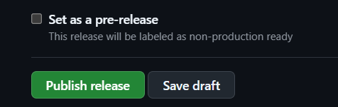
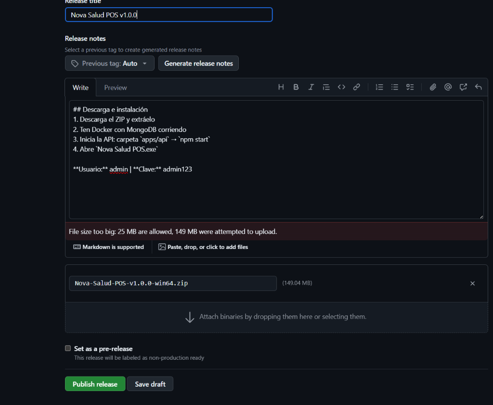
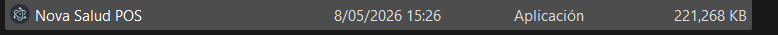

# PRUEBAS DE CONEXIÓN - NOVA SALUD POS

Este documento sirve como evidencia técnica de que el sistema **Nova Salud POS** se conecta correctamente con el contenedor de Docker (MongoDB) y que los datos se persisten de forma correcta tanto en la aplicación como en la base de datos externa.

---

## 1. Conexión con la Base de Datos (Docker)
El sistema utiliza **Docker Desktop** para gestionar la instancia de MongoDB. En la siguiente captura se observa que la aplicación está cargando los productos directamente desde la base de datos en tiempo real.

---

## 2. Persistencia en MongoDB Compass
Para verificar que los datos no son temporales y se guardan correctamente, hemos conectado **MongoDB Compass** a la URI local `mongodb://127.0.0.1:27017/nova-salud`.

### Listado de Bases de Datos
Se puede observar la base de datos `nova-salud` creada automáticamente por el sistema:

### Datos de Productos
Aquí se muestran los registros de los productos dentro de la colección `products`, coincidiendo exactamente con lo que muestra la aplicación:

---

## 3. Conclusión
Las pruebas demuestran que:
*   ✅ El contenedor de **Docker** responde correctamente.
*   ✅ El **Backend (API)** puede escribir y leer datos sin errores.
*   ✅ La **Interfaz (Frontend)** muestra la información actualizada.
*   ✅ Los datos son **persistentes** y accesibles externamente vía Compass.

---
**Nova Salud Team** - *Evidencia de Desarrollo 2026*
